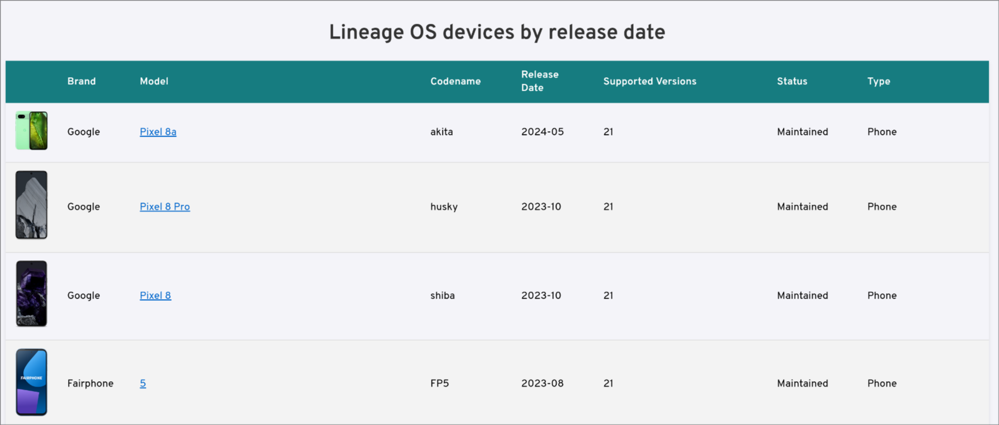

# LineageOS Devices Timeline

A static website that displays currently supported LineageOS devices organized by release date.



## Overview

This project generates a timeline view of LineageOS-supported devices, showing when each device was first added to the official LineageOS wiki and its current release status.

The website is hosted at: [https://dbeley.github.io/lineageos-devices-timeline](https://dbeley.github.io/lineageos-devices-timeline)

## Requirements

- Python 3.x
- PyYAML
- Git (for accessing the LineageOS wiki submodule)

## Setup

```bash
# Initialize and update the LineageOS wiki submodule
git submodule init
git submodule update

# Install Python dependencies
pip install pyyaml
```

## Usage

Generate the timeline website:

```bash
python lineageos_devices_timeline.py
```

This reads device data from the `lineage_wiki/_data/devices/` directory and generates `docs/index.html` based on `template.html`.

## How it works

1. Parses YAML device definitions from the LineageOS wiki submodule
2. Queries git history to determine when each device was first added
3. Extracts device metadata (codename, maintainer, release version, etc.)
4. Generates a static HTML timeline sorted by first-commit date

## Updating

To refresh the device list:

```bash
# Pull latest wiki changes
cd lineage_wiki
git pull origin main
cd ..

# Regenerate the website
python lineageos_devices_timeline.py
```

## Deployment

The `docs/` directory is configured for GitHub Pages. After regenerating `docs/index.html`, commit and push to update the live site.

## Credits

- Device data: [LineageOS Wiki](https://github.com/LineageOS/lineage_wiki)

## Contributing

Contributions are welcome! Please feel free to submit a Pull Request or open an issue for bugs, features, or documentation improvements.

### Development

1. Clone the repository with submodules:
   ```bash
   git clone --recurse-submodules https://github.com/dbeley/lineageos-devices-timeline
   cd lineageos-devices-timeline
   ```
2. Install dependencies: `pip install pyyaml`
3. Run the generator: `python lineageos_devices_timeline.py`
4. Test locally by opening `docs/index.html`

## License

This project is licensed under the MIT License - see the [LICENSE](LICENSE) file for details.
